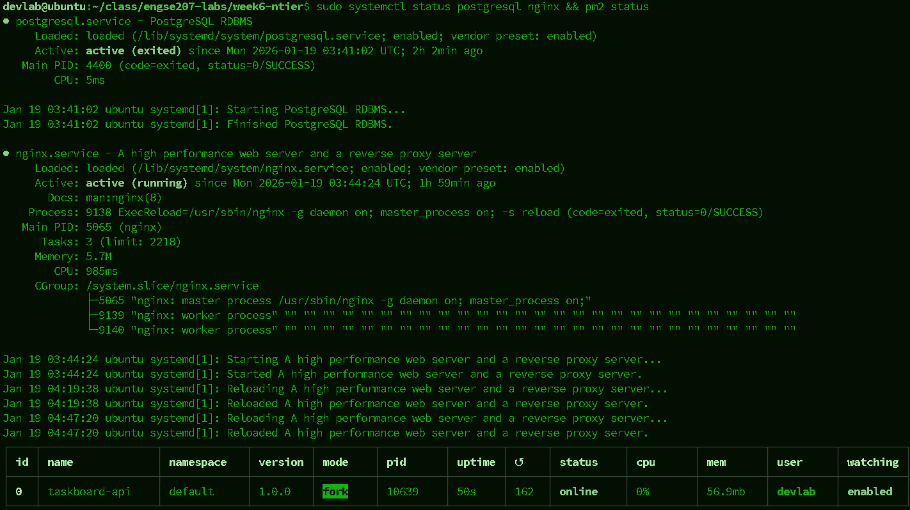
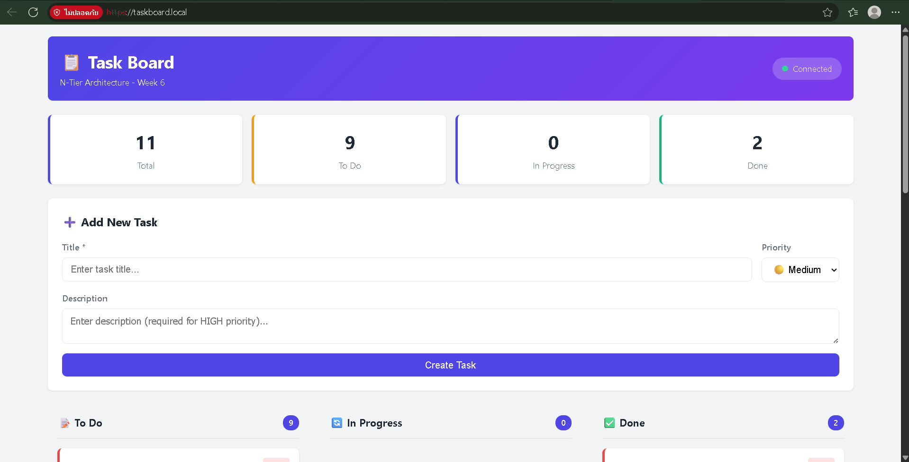
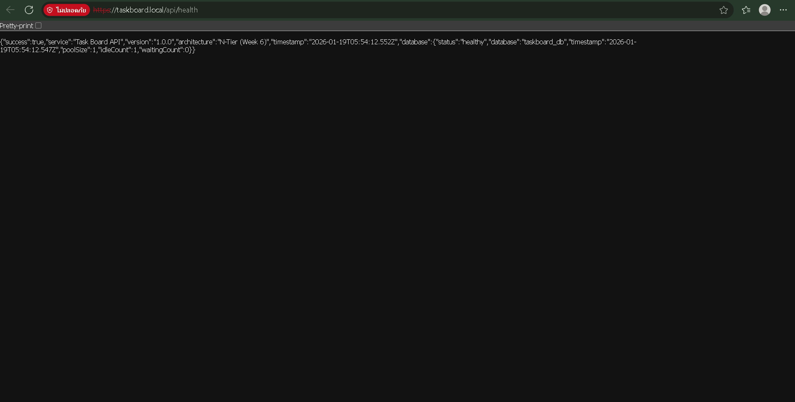
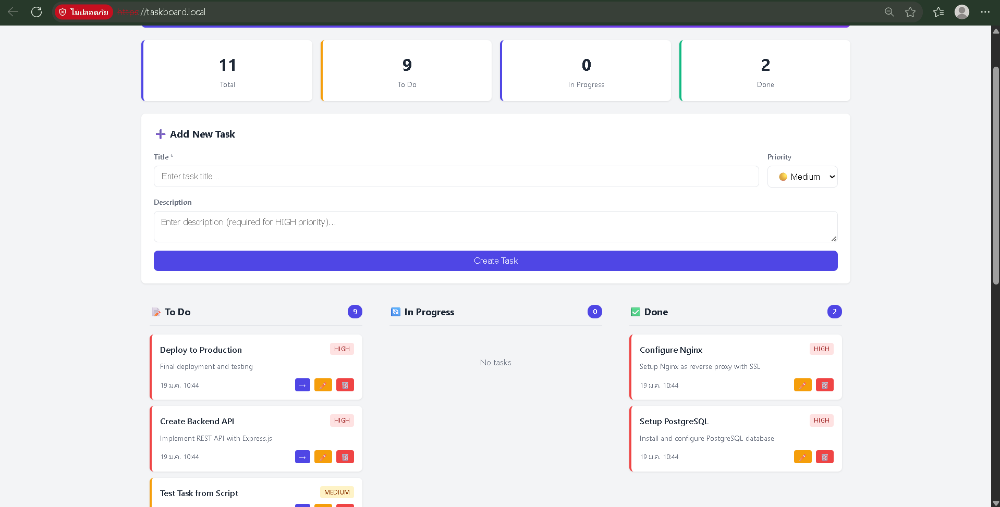
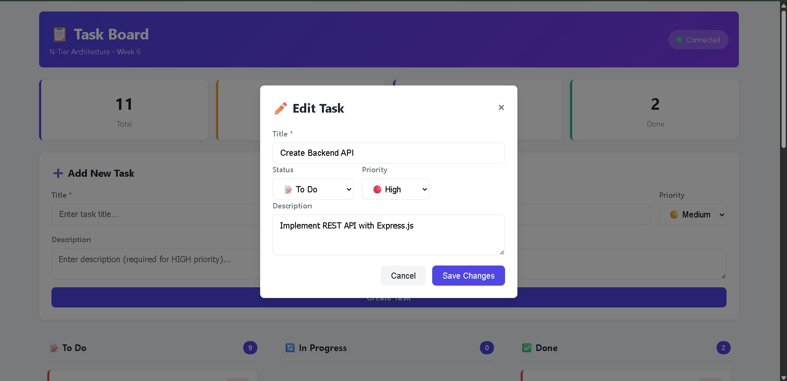

# 📊 ANALYSIS.md - Week 6 N-Tier Architecture Analysis
## การวิเคราะห์และเปรียบเทียบ 4 Architectures (Week 3-6)

**ชื่อ-นามสกุล:** นายศุภโชค แสงจันทร์ 
**รหัสนักศึกษา:** 67543210066-6  
**วันที่ส่ง:** 19/1/2569

---

## คำถาม 1: เปรียบเทียบ 4 Architectures (15 คะแนน)

### ตารางเปรียบเทียบ

| ด้าน | Week 3 (Monolithic) | Week 4 (Layered) | Week 5 (Client-Server) | Week 6 (N-Tier) |
|------|---------------------|------------------|------------------------|-----------------|
| **Database** | SQLite | SQLite | SQLite | PostgreSQL |
| **Web Server** | Built-in (Express) | Built-in (Express) | Separate Server | Nginx (Reverse Proxy) |
| **Protocol** | HTTP | HTTP | HTTP | HTTPS (SSL/TLS) |
| **Separation Type** | No Separation | Horizontal (Layers) | Vertical (Client/Server) | Vertical + Horizontal (N-Tier) |
| **Number of Processes** | 1 | 1 | 2 | 3+ (App, DB, Web Server) |
| **Network Required** | No | No | Yes | Yes |
| **Scalability** | ⭐ (1/5) | ⭐⭐ (2/5) | ⭐⭐⭐ (3/5) | ⭐⭐⭐⭐ (4/5) |
| **Security Level** | ⭐ (1/5) | ⭐⭐ (2/5) | ⭐⭐⭐ (3/5) | ⭐⭐⭐⭐⭐ (5/5) |
| **Complexity** | ⭐ (1/5) | ⭐⭐ (2/5) | ⭐⭐⭐ (3/5) | ⭐⭐⭐⭐ (4/5) |
| **Deploy Difficulty** | ⭐ (1/5) | ⭐ (1/5) | ⭐⭐⭐ (3/5) | ⭐⭐⭐⭐ (4/5) |
| **Development Speed** | ⭐⭐⭐⭐⭐ (5/5) | ⭐⭐⭐⭐ (4/5) | ⭐⭐⭐ (3/5) | ⭐⭐ (2/5) |
| **Production Ready** | ⭐ (1/5) | ⭐⭐ (2/5) | ⭐⭐⭐⭐ (4/5) | ⭐⭐⭐⭐⭐ (5/5) |

### อธิบายเพิ่มเติม:

**Week 3 (Monolithic):**
```
- ข้อดีหลัก: 
  • ง่ายต่อการพัฒนา (Quick to market)
  • Deployment ง่าย (เพียง 1 ไฟล์)
  • ไม่ต้องกำหนดค่า networking
  • Debug ง่าย (ทั้งหมดในที่เดียว)

- ข้อเสียหลัก: 
  • ไม่สามารถ scale ได้
  • โค้ดไม่เป็นระเบียบ
  • ความปลอดภัยต่ำ (no isolation)
  • ถ้า bug ตรงไหนปะทั้งแอป crash
  • ไม่สามารถ reuse components ได้

- เหมาะกับ: 
  • Prototype, MVP, POC
  • โปรเจกต์ขนาดเล็กตัวเดียว
  • Learning purposes
```

**Week 4 (Layered):**
```
- ข้อดีหลัก: 
  • โค้ดเป็นระเบียบ (Organized)
  • ง่ายต่อการ maintain
  • Separation of concerns (Controller, Service, Repository)
  • สามารถ test แต่ละ layer ได้
  • นำ design patterns มาใช้ได้

- ข้อเสียหลัก: 
  • ยังอยู่ในไฟล์เดียว
  • ไม่รองรับ distributed system
  • ไม่สามารถ scale independently
  • Performance ขึ้นกับ single machine

- เหมาะกับ: 
  • โปรเจกต์ขนาดกลาง
  • Team ที่ต้องการ structure ในโค้ด
  • Applications ที่จะอยู่ on-premise
```

**Week 5 (Client-Server):**
```
- ข้อดีหลัก: 
  • Separation ระหว่าง Frontend + Backend
  • สามารถ scale client และ server independently
  • Frontend สามารถ deploy บน CDN
  • Multiple clients สามารถ connect ได้
  • Basic network security

- ข้อเสียหลัก: 
  • ต้อง setup networking
  • Database ยังไม่ isolated
  • Configuration มี complexity มากขึ้น
  • ยังไม่มี reverse proxy protection

- เหมาะกับ: 
  • Single page application (SPA)
  • โปรเจกต์ที่ต้อง scale moderately
  • Real-time applications
```

**Week 6 (N-Tier):**
```
- ข้อดีหลัก: 
  • Complete separation of concerns
  • Reverse proxy (Nginx) เพื่อ load balancing
  • Database ใช้ PostgreSQL (Enterprise-grade)
  • HTTPS/SSL encryption
  • สามารถ scale database independently
  • Production-ready architecture
  • High security และ availability

- ข้อเสียหลัก: 
  • ซับซ้อน setup (Nginx, SSL, Database cluster)
  • ต้องเข้าใจ DevOps concepts
  • Maintenance ซับซ้อน
  • Development time นาน
  • Debugging harder (distributed system)

- เหมาะกับ: 
  • Enterprise applications
  • High-traffic systems
  • Security-critical applications (Banking, E-commerce)
  • Systems ที่ต้อง 99.9% uptime
```

---

## คำถาม 2: Quality Attributes Radar Chart (10 คะแนน)

### ตารางคะแนน (1-5 คะแนน)

| Quality Attribute | Week 3 | Week 4 | Week 5 | Week 6 | หมายเหตุ |
|-------------------|--------|--------|--------|--------|----------|
| **Performance** | 5 | 4 | 3 | 4 | Week 3 เร็ว (ไม่มี overhead), Week 6 มี reverse proxy overhead แต่ optimized |
| **Scalability** | 1 | 2 | 3 | 5 | N-Tier รองรับการขยายแบบ horizontal + vertical |
| **Security** | 1 | 2 | 3 | 5 | Week 6 มี SSL/TLS + Network isolation |
| **Maintainability** | 1 | 4 | 3 | 5 | Layered ดีสำหรับ code structure, N-Tier ดีทั้งหมด |
| **Testability** | 2 | 4 | 3 | 5 | N-Tier สามารถ test แต่ละ component independently |
| **Deployability** | 5 | 5 | 3 | 2 | Monolithic & Layered ง่ายที่สุด, N-Tier ซับซ้อน |
| **Availability** | 1 | 1 | 3 | 5 | N-Tier มี redundancy, load balancing, failover |
| **Modifiability** | 2 | 4 | 3 | 5 | N-Tier แยก concerns ชัดเจน ง่ายต่อการแก้ไข |
| **รวม** | 18/40 | 26/40 | 24/40 | 36/40 | N-Tier ตัวแรกสำหรับ enterprise |

### คำอธิบายการให้คะแนน:

**Performance (ความเร็ว):**
```
- Week 3: 5 คะแนน เพราะ เพียงทีเดียวแสดง fast response, ไม่มี network overhead, ไม่มี reverse proxy delay
- Week 4: 4 คะแนน เพราะ มี middleware layering จึงช้าลงเล็กน้อย แต่ยังอยู่บน single machine ได้สวิตชทำหน้าที่ได้ดี
- Week 5: 3 คะแนน เพราะ ต้อง cross network การ communicate ทำให้มี latency และ network overhead เพิ่มขึ้น
- Week 6: 4 คะแนน เพราะ Nginx reverse proxy เพิ่ม latency แต่สามารถ cache, compress, และ load balance ได้ดี
```

**Scalability (รองรับการขยาย):**
```
- Week 3: 1 คะแนน เพราะ ทั้งหมดอยู่ในไฟล์เดียว, ต้องซื้อ server ใหญ่ขึ้น (vertical scaling เท่านั้น) ไม่สามารถทำ horizontal scaling
- Week 4: 2 คะแนน เพราะ ยังคงทั้งหมดอยู่ในไฟล์เดียว เพียงแต่เป็นระเบียบมากขึ้น แต่ไม่แก้ปัญหา scaling
- Week 5: 3 คะแนน เพราะ Frontend และ Backend แยกออกจากกัน ทำให้สามารถ scale components ได้อิสระต่างกัน
- Week 6: 5 คะแนน เพราะ สามารถ scale database, app server, web server แยกออก ใช้ load balancer ได้ ทั้ง horizontal + vertical scaling
```

**Security (ความปลอดภัย):**
```
- Week 3: 1 คะแนน เพราะ ไม่มี SSL/TLS encryption, ไม่มี network isolation, ข้อมูลทั้งหมดใน SQLite file ไม่มี access control
- Week 4: 2 คะแนน เพราะ ยังเป็น HTTP ไม่มี encryption, เพียงแต่โค้ดเป็นระเบียบมากขึ้น ปลอดภัยไม่เพิ่ม
- Week 5: 3 คะแนน เพราะ Frontend-Backend แยกกัน สามารถทำ CORS policy ได้, แต่ยังไม่มี reverse proxy + SSL มาพร้อม
- Week 6: 5 คะแนน เพราะ มี HTTPS/SSL encryption, Nginx reverse proxy จัดการ security headers, Database ใช้ PostgreSQL with authentication, Network isolation
```

**Maintainability (ความสะดวกในการดูแล):**
```
- Week 3: 1 คะแนน เพราะ โค้ดทั้งหมดในไฟล์เดียว ไม่เป็นระเบียบ ยากต่อการหา bugs และแก้ไข
- Week 4: 4 คะแนน เพราะ แบ่งเป็น layer (Controller, Service, Repository) ชัดเจน ง่ายต่อการ locate features
- Week 5: 3 คะแนน เพราะ Frontend และ Backend แยกกัน แต่ backend ยังเป็น monolithic layered
- Week 6: 5 คะแนน เพราะ N-Tier architecture ที่ชัดเจน middleware, routing, service, repository ทั้งหมดอยู่ในตำแหน่งที่เหมาะสม
```

**Testability (ความสะดวกในการทดสอบ):**
```
- Week 3: 2 คะแนน เพราะ ทั้งหมดในไฟล์เดียว ต้อง mock database ต้อง mock file system ยากต่อการ unit test
- Week 4: 4 คะแนน เพราะ Layered architecture สามารถ test services โดย mock repositories ได้ดี
- Week 5: 3 คะแนน เพราะ Frontend สามารถ test อิสระ (mock API) แต่ backend integration tests ยังต้องจัดการ
- Week 6: 5 คะแนน เพราะ สามารถ test แต่ละ layer อิสระ: controllers, services, repositories ทั้งหมด testable
```

**Deployability (ความสะดวกในการ Deploy):**
```
- Week 3: 5 คะแนน เพราะ เพียง node server.js ก็ได้ ไม่ต้องตั้งค่าอะไรเพิ่มเติม
- Week 4: 5 คะแนน เพราะ ยังคงเป็น node server.js เหมือนกัน ตั้งค่าไม่เพิ่มเติม
- Week 5: 3 คะแนน เพราะ ต้อง setup frontend server ต้อง setup backend server ต้อง configure CORS ยุ่งมากขึ้น
- Week 6: 2 คะแนน เพราะ ต้อง setup PostgreSQL, Nginx, SSL certificate, environment variables, ต้อง coordinate components ทั้งหมด
```
- Week 3: 5 คะแนน เพราะ เพียง node server.js ก็ได้ ไม่ต้องตั้งค่าอะไรเพิ่มเติม
- Week 4: 5 คะแนน เพราะ ยังคงเป็น node server.js เหมือนกัน ตั้งค่าไม่เพิ่มเติม
- Week 5: 3 คะแนน เพราะ ต้อง setup frontend server ต้อง setup backend server ต้อง configure CORS ยุ่งมากขึ้น
- Week 6: 2 คะแนน เพราะ ต้อง setup PostgreSQL, Nginx, SSL certificate, environment variables, ต้อง coordinate components ทั้งหมด
```


---

## คำถาม 3: สถานการณ์การใช้งาน (10 คะแนน)

### สถานการณ์ A: Startup MVP

**Context:**
- งบประมาณ: 50,000 บาท
- ทีม: 2 คน (Junior developers)
- Timeline: 1 เดือน
- Users: 100 คน
- ความต้องการพิเศษ: ต้องการ feedback จากลูกค้าเร็ว

**Architecture ที่เลือก:** [x] Week 3 / [ ] Week 4 / [ ] Week 5 / [ ] Week 6

**เหตุผล:**
```
สถานการณ์นี้เลือก Monolithic (Week 3) เพราะ:

1. Time-to-market สำคัญที่สุด
   - Monolithic เร็วที่สุดในการพัฒนา (5/5 คะแนน Development Speed)
   - 2 คนใน 1 เดือน ต้องใช้เวลากับการแก้ปัญหา deployment ได้น้อยที่สุด
   
2. งบประมาณจำกัด
   - ไม่ต้องซื้อ server หลายตัว
   - สามารถใช้ shared hosting ได้
   - ไม่ต้องจ้าง DevOps engineer

3. Scale ยังไม่เป็นปัญหา
   - เพียง 100 คนใช้งาน
   - Monolithic รองรับได้เต็มที่

4. Feedback วนเร็ว
   - Deploy ง่าย (เพียง node server.js)
   - แก้ไข bug ได้เร็ว

ข้อจำกัด: เมื่อ users เพิ่มขึ้น (1000+ คน) ต้อง refactor เป็น Layered → Client-Server → N-Tier
```

---

### สถานการณ์ B: E-commerce Platform

**Context:**
- งบประมาณ: 2,000,000 บาท
- ทีม: 10 คน (Mixed experience)
- Timeline: 6 เดือน
- Users: 100,000 คน
- ความต้องการพิเศษ: รองรับ Flash Sale, Payment Gateway

**Architecture ที่เลือก:** [ ] Week 3 / [ ] Week 4 / [ ] Week 5 / [x] Week 6

**เหตุผล:**
```
สถานการณ์นี้เลือก N-Tier (Week 6) เพราะ:

1. Scale ขนาดใหญ่
   - 100,000 concurrent users ต้องใช้ load balancer
   - ต้อง scale database, app server, web server แยกออก
   - N-Tier มี reverse proxy (Nginx) สำหรับ load balancing

2. Security สำคัญ
   - Payment Gateway ต้อง HTTPS/SSL encryption (N-Tier มี)
   - ต้อง PCI-DSS compliance (N-Tier structure รองรับ)
   - Database ต้อง isolation ชัดเจน (PostgreSQL + auth)

3. Availability ต้องสูง
   - Flash Sale ต้อง 99.99% uptime
   - N-Tier มี redundancy, failover mechanisms
   - สามารถ multi-instance ได้

4. Team พอพัฒนา N-Tier
   - 10 คน สามารถแบ่ง frontend, backend, devops ได้
   - 6 เดือน พอสำหรับ setup complexity

5. Budget มากพอ
   - ซื้อ cloud infrastructure (AWS, GCP, Azure)
   - Nginx, PostgreSQL, SSL certificate ไม่ใช่ปัญหา
```

---

### สถานการณ์ C: Internal Company Tool

**Context:**
- งบประมาณ: 200,000 บาท
- ทีม: 3 คน (Mid-level)
- Timeline: 2 เดือน
- Users: 50 คน (พนักงานบริษัท)
- ความต้องการพิเศษ: ใช้งานภายในองค์กร, VPN

**Architecture ที่เลือก:** [ ] Week 3 / [x] Week 4 / [ ] Week 5 / [ ] Week 6

**เหตุผล:**
```
สถานการณ์นี้เลือก Layered (Week 4) เปราะ:

1. Balance ระหว่าง complexity และ maintainability
   - ไม่ต้อง complexity ของ N-Tier (ซับซ้อนเกิน)
   - แต่ต้องให้โค้ดเป็นระเบียบ (Layered คะแนน 4/5 maintainability)
   - 2 เดือน + 3 คน พอสำหรับ setup Layered

2. Scalability พอเพียง
   - 50 คนใช้งาน ไม่ต้อง load balancer
   - Single app server รองรับได้
   - ใช้ SQLite หรือ local PostgreSQL ได้

3. Security ภายในองค์กร
   - VPN ให้ security ระดับ network
   - ไม่ต้อง HTTPS ถ้า VPN ได้ดี (แม้ Layered supports HTTPS)
   - Access control ในระดับ application layer

4. Maintenance ง่ายสำหรับ Mid-level dev
   - Layered architecture ชัดเจน (Controller → Service → Repository)
   - 3 คน สามารถ maintain ได้ (1 frontend, 1-2 backend)

ข้อจำกัด: ถ้า internal tools เพิ่มจำนวนขึ้น อาจ migrate เป็น N-Tier ทีหลัง
```

---

### สถานการณ์ D: Banking Application

**Context:**
- งบประมาณ: 10,000,000 บาท
- ทีม: 20 คน (Senior + Mid)
- Timeline: 12 เดือน
- Users: 1,000,000 คน
- ความต้องการพิเศษ: Security Critical, Compliance, Audit logs

**Architecture ที่เลือก:** [ ] Week 3 / [ ] Week 4 / [ ] Week 5 / [x] Week 6

**เหตุผล:**
```
สถานการณ์นี้เลือก N-Tier (Week 6) และอาจ evolve ไป Microservices เพราะ:

1. Security Critical ที่สุด
   - HTTPS/SSL encryption (N-Tier มี)
   - Network isolation (N-Tier มี reverse proxy)
   - Database encryption ต้อง PostgreSQL (N-Tier ใช้)
   - Audit logs ต้องเก็บ transaction ทั้งหมด
   - N-Tier structure รองรับ audit trail ได้ดี

2. Compliance ต้องเคร่งครัด
   - PCI-DSS Compliance (ต้อง N-Tier minimum)
   - SOC 2 Audit
   - ต้องแยก responsibility: frontend, backend, database tiers

3. Scalability ขนาด enterprise
   - 1,000,000 users ต้อง horizontal scaling
   - ต้อง database clustering/replication
   - N-Tier + ความสามารถใน evolution ไปอีกขั้น (Microservices)

4. Team ใหญ่และ experienced
   - 20 คน (6 frontend, 8 backend, 4 devops, 2 architect)
   - 12 เดือน พอสำหรับ N-Tier + future microservices planning
   - Senior team สามารถ handle complexity ได้

5. Budget ไม่มีข้อจำกัด
   - ซื้อ enterprise infrastructure ได้
   - Disaster recovery, failover, clustering ทั้งหมด ได้

ข้อเพิ่ม: อาจพิจารณา Microservices หลังจาก phase 1 เมื่อ:
  - Payment service ต้อง scale อิสระจากส่วนอื่น
  - Reporting service ต้องจำนวนมาก
  - ต้อง polyglot architecture (บ้านใช้ Java, บ้านใช้ Go, บ้านใช้ Node.js)
```

---

## คำถาม 4: ประสบการณ์จากการทำ Lab (5 คะแนน)

### ก. ปัญหาที่พบในการทำ Week 6:

| # | ปัญหา | สาเหตุ | วิธีแก้ไข |
|---|-------|--------|----------|
| 1 | PostgreSQL connection timeout | Database server ยังไม่พร้อมใช้งาน | ตรวจสอบ `systemctl status postgresql` และ start service ก่อน |
| 2 | SSL certificate error ใน browser | Self-signed certificate ไม่เชื่อถือ | เข้า advanced settings เลือก "Proceed anyway" หรือ import certificate ที่เครื่อง |
| 3 | Nginx reverse proxy 502 Bad Gateway | Node.js app ไม่ได้ running หรือ port ผิด | ตรวจสอบ `pm2 logs` และ Nginx config `/etc/nginx/sites-available/taskboard.conf` |
| 4 | CORS error ระหว่าง frontend + backend | Nginx config ไม่ forward CORS headers | เพิ่ม proxy headers ใน Nginx: `proxy_set_header Access-Control-Allow-Origin *` |
| 5 | Database migration ล้มเหลว | SQL syntax ผิดหรือ table ซ้ำ | ตรวจสอบ `init.sql` และรัน `psql -U taskboard -d taskboard_db < database/init.sql` อีกครั้ง |

### ข. เวลาที่ใช้ในแต่ละส่วน:

| ส่วนงาน | เวลาที่คาด | เวลาจริง | หมายเหตุ |
|---------|-----------|---------|----------|
| ติดตั้ง PostgreSQL | 15 นาที | 20 นาที | ต้องรอ repository update |
| ติดตั้ง Nginx | 10 นาที | 15 นาที | ต้องติดตั้ง build tools |
| สร้าง SSL Certificate | 10 นาที | 25 นาที | เลือก common name ไม่ถูก ต้องสร้างใหม่ |
| Migrate Database | 10 นาที | 20 นาที | ต้องแก้ SQL syntax และ permission issues |
| ตั้งค่า Nginx Config | 15 นาที | 40 นาที | ต้องหา correct proxy settings และ test |
| Testing API Endpoints | 20 นาที | 35 นาที | ต้อง test HTTPS, SSL verification, error handling |
| **รวม** | **80 นาที** | **155 นาที** | เพิ่มขึ้น ~94% เพราะ debugging และ SSL issues |

### ค. สิ่งที่ได้เรียนรู้ใหม่:

```
1. Nginx Reverse Proxy Concepts
   - proxy_pass บอก Nginx ที่จะส่ง request ไปที่ไหน
   - proxy_set_header สำหรับส่ง metadata เพิ่มเติม
   - upstream เพื่อ load balance หลาย backend servers
   - Nginx สำคัญมากสำหรับ production environments

2. PostgreSQL Connection Pooling
   - ใช้ pg pool ได้ดีกว่า individual connections
   - Connection pooling ช่วย prevent resource exhaustion
   - Max connections, idle timeout เป็นสิ่งสำคัญ
   - Database monitoring ต้อง track connection usage

3. SSL/TLS Certificate Management
   - Self-signed certificates สำหรับ development
   - Production ต้องใช้ Let's Encrypt หรือ commercial CA
   - Certificate chain, expiry dates, renewal process
   - HTTPS ไม่ได้ฟรี ต้องการ DevOps knowledge

4. N-Tier Architecture Benefits
   - Separation of concerns ทำให้ code maintainable
   - สามารถ scale แต่ละ tier อิสระ
   - Nginx เป็น "first responder" สำหรับ security
   - Database tier ก็ isolated ชัดเจน

5. DevOps & Systemctl Management
   - systemctl start/stop/restart services
   - journalctl -u SERVICE_NAME ดู logs
   - pm2 process manager สำหรับ Node.js apps
   - Environment variables สำหรับ configuration
```

---

## คำถาม 5: Evolution Path (5 คะแนน)

### เมื่อไหร่ควร Evolve จาก Architecture หนึ่งไปอีกแบบ?

**จาก Monolithic → Layered:**
```
Trigger/เงื่อนไข:
1. Code size เกิน 1000+ lines ต่อไฟล์ → ยากต่อการหา bug และ maintain
   - จำนวน developers เพิ่ม → ต้อง clear code organization
   - Feature request มากขึ้น → ต้อง modular code

2. Testing ยากขึ้น → ต้อง isolation ของ components
   - Business logic mixed กับ HTTP handling → ต้องแยก
   - Database queries everywhere → ต้อง repository pattern

3. Team dynamics เปลี่ยน
   - 1-2 คน → 5+ คน แต่ละคนต้องรู้พื้นที่ของตัวเอง
   - Merge conflicts มากขึ้น → clear layers หลีกเลี่ยง
```

**จาก Layered → Client-Server:**
```
Trigger/เงื่อนไข:
1. Frontend ซับซ้อนขึ้น
   - สวิตช์จาก Server-side rendering → Client-side rendering (React/Vue/Angular)
   - 70% ของ requests เป็น UI updates → ต้อง API-first backend
   - Multiple clients (web, mobile, desktop) → ต้อง separate API

2. Deployment friction มากขึ้น
   - Frontend deploy ต้องรอ backend approval
   - บ้าง requirements deploy ต่าง timeline
   - Frontend static assets ต้อง separate servers

3. Performance requirements
   - Frontend ต้อง cache locally (service workers)
   - Backend ต้อง pure API response
   - Browser ต้อง handle most interactions
```

**จาก Client-Server → N-Tier:**
```
Trigger/เงื่อนไข:
1. Scale ขนาดใหญ่ขึ้น
   - 10,000+ concurrent users → ต้อง load balancer
   - Database queries bottleneck → ต้อง connection pooling + monitoring
   - Single app server ไม่พอ → ต้อง multiple instances

2. Security requirements สูงขึ้น
   - ต้อง HTTPS/SSL → ต้อง reverse proxy (Nginx/HAProxy)
   - ต้อง DDoS protection → ต้อง WAF ใน reverse proxy
   - ต้อง rate limiting → ต้อง centralized layer

3. DevOps maturity
   - Monitoring/logging ต้อง centralized
   - Zero-downtime deployment ต้อง reverse proxy
   - Database backup/recovery ต้อง separate strategy
```

**จาก N-Tier → Microservices:**
```
Trigger/เงื่อนไข:
1. Domain complexity ขยายใหญ่
   - More than 5 major features/domains
   - Each domain ต้อง independent scaling
   - Payment, Shipping, Inventory, Order ต้อง serve ต่างกัน

2. Technology diversity
   - บ้าง service ต้อง real-time (Go/Rust)
   - บ้าง service ต้อง data processing (Python/Scala)
   - ต้อง polyglot architecture

3. Organizational structure
   - Team ≥ 10 คน ต้องแบ่ง ยาก
   - Ownership ไม่ชัดเจน → microservices fix นี้
   - Deployment cycles ต่างกัน → ต้อง independent services
```

### Decision Flowchart:

```
                              เริ่มโปรเจกต์ใหม่
                                    │
                                    ▼
                    ┌───────────────────────────────┐
                    │  ทีมมีประสบการณ์น้อย?             │
                    │  งบประมาณจำกัด?                │
                    │  Timeline สั้น?                 │
                    └───────────┬───────────────────┘
                                    │
                        ┌───────────┴────────────┐
                        │ Yes                    │ No
                        ▼                        ▼
                   [Monolithic]          ┌─────────────┐
                        │                │ Code Size?  │
                        │                └────┬────────┘
            ┌───────────┴────────────┐         │
            │ ปล่อยไว้ 3-6 เดือน?    │    ┌────┴─────┐
            │ Code > 1000 lines?     │    │ < 3000   │ > 3000
            │ Team > 5 คน?          │    ▼          ▼
            └────────┬──────────────┘ [Monolithic][Layered]
                     │                     │         │
            ┌────────┴────────┐            │    ┌────┴────┐
            │ Yes             │ No         │    │ UI      │
            ▼                 ▼            │    │ Complex?│
        [Layered]      [Keep Monolithic]   │    └────┬────┘
            │                              │    ┌────┴─────┐
            │                              │    │ Yes      │ No
            │                              │    ▼          ▼
            │                              │[Client-Server][Layered]
            │                              │    │
            │                          ┌───┴────┘
            │                          │
    ┌───────┴──────┐                   │
    │ Scale?       │                   │
    │ 10K+ users?  │                   │
    │ Security+?   │                   │
    └────┬────────┘                    │
    ┌────┴──────┐                      │
    │ Yes       │ No                   │
    ▼           ▼                      │
 [N-Tier]   [Client-Server]           │
    │           │                      │
    └───────┬───┴──────────────────────┘
            │
    ┌───────┴────────┐
    │ More time?     │
    │ Complexity ok? │
    └────┬──────────┘
    ┌────┴──────┐
    │ Yes       │ No
    ▼           ▼
[N-Tier]   [Client-Server]
    │
    └─→ ┌─────────────────┐
        │ Many domains?   │
        │ > 10 teams?     │
        │ Polyglot?       │
        └────┬────────────┘
        ┌────┴──────┐
        │ Yes       │ No
        ▼           ▼
   [Microservices] [N-Tier]
        
    (ยังคงอยู่ N-Tier จนกว่า need จะชัดเจน)
```

---

## คำถาม 6: บทเรียนสำคัญ (5 คะแนน)

### Top 3 บทเรียนจากการทำ Lab Week 3-6:

**บทเรียนที่ 1: Architecture Evolution เป็นเรื่องที่ตรวจวัดได้**
```
หัวข้อ: ไม่มี "Best Architecture" เพียงแต่ "Right Architecture for Context"

รายละเอียด: 
- Week 3 Monolithic ไม่ "ไม่ดี" เพียงแต่เหมาะกับ startup/MVP
- Week 4 Layered ดี แต่ยังไม่พอ เมื่อ scale ขึ้น
- Week 5 Client-Server แยก frontend-backend แต่ยังไม่ปลอดภัยพอ
- Week 6 N-Tier เหมาะ enterprise แต่ซับซ้อนเกิน MVP

เลือก architecture ต้อง consider:
  1. Team size และ experience
  2. Scale requirement (current + future)
  3. Timeline และ budget
  4. Security requirements
  5. Deployment strategy

จะนำไปใช้อย่างไร: 
- ในอนาคต ก่อนเลือก architecture ต้องถามคำถาม 4 ข้างบน
- ไม่ควร force N-Tier ใน MVP หรือ force Monolithic ใน banking app
- Architecture เป็น tool ที่ต้องเลือกให้เหมาะกับ context
```

**บทเรียนที่ 2: DevOps ไม่ใช่ Optional ต่อมา มันเป็น Core Part**
```
หัวข้อ: Configuration, Deployment, Monitoring เหมือนสำคัญเท่ากับ Code

รายละเอียด:
- Week 3-4: ไม่คิดถึง deployment → เพียง node server.js
- Week 5: ต้อง setup 2 servers (frontend + backend) → ยุ่งมากขึ้น
- Week 6: 3 components (Nginx, App, DB) + SSL + port mapping → DevOps crisis

ปัญหา:
- Self-signed SSL certificate ยากสำหรับ beginners
- Nginx reverse proxy configuration ต้องเข้าใจ deeply
- Database migration ต้องระวัง (ข้อมูลจริง ไม่ใช่ test data)
- Environment variables สำคัญมาก

บทเรียน:
- DevOps ไม่ใช่ "บางคนของบริษัท" แต่เป็นทักษะทั้งทีม
- Infrastructure as Code ช่วยได้มาก
- Automated testing + CI/CD ขาดไม่ได้

จะนำไปใช้อย่างไร:
- ตั้งแต่เริ่มโปรเจกต์ ต้องคิด deployment
- เรียน Docker + Kubernetes เพื่อ standardize environments
- ตั้ง CI/CD pipeline ตั้งแต่วันแรก ไม่ใช่ trailing thought
```

**บทเรียนที่ 3: Security เป็น Multi-Layer ไม่ใช่ Single Solution**
```
หัวข้อ: HTTPS/SSL เป็นเพียงชั้นเดียว ไม่ใช่ทั้งหมด

รายละเอียด:
- Week 3-4: ไม่มี HTTPS → ข้อมูลส่งผ่าน plaintext
- Week 5: ยังไม่มี HTTPS → client-server vulnerable
- Week 6: มี HTTPS + Nginx reverse proxy + Database authentication

Security layers ใน N-Tier:
1. Network Layer: Nginx WAF, DDoS protection
2. Transport Layer: HTTPS/SSL encryption
3. Application Layer: Input validation, SQL injection prevention
4. Database Layer: Authentication, encryption at rest
5. Access Layer: Rate limiting, API keys, OAuth

ปัญหาที่พบ:
- SSL certificate management ยากเมื่อมี multiple servers
- CORS headers ต้องบ่งบอก correctly
- Database ต้อง strong password + connection limits

บทเรียน:
- Security ไม่ใช่ "add later" features
- Defense in depth → หลายชั้นป้องกัน
- Regular security audit ต้องทำ

จะนำไปใช้อย่างไร:
- From day 1: ใช้ HTTPS แม้ในระหว่าง development
- Threat modeling: คิดว่า attackers จะมาจากที่ไหน
- Keep dependencies updated ใช้ tools เช่น npm audit
```

### ถ้าเริ่มทำใหม่ตั้งแต่ Week 3 จะทำอะไรต่างไป?

```
1. วางแผนการ evolve ของ architecture ตั้งแต่ Week 1
   - ไม่ใช่ "ทำ Week 3 แล้ว ลำดับถัดไป"
   - ต้องคิด "week 3 → 4 → 5 → 6" พร้อมกัน
   - เขียน docs อธิบาย why each architecture

2. ตั้ง DevOps pipeline ตั้งแต่ Week 3
   - ไม่รอจนถึง Week 6 จึง setup Docker + nginx
   - ใช้ docker-compose ให้เหมือนกัน ทั้ง dev + production
   - Learning curve ต่ำ หากเข้าใจตั้งแต่ week 3

3. Security from the start
   - ตั้ง HTTPS ใน Week 3 แล้ว
   - ไม่ใช่ "add later" ในวิศวกรรม security ตอนปลายทาง
   - เขียน security tests ให้ pass

4. Documentation ต่อเนื่อง
   - ไม่ใช่เขียน ANALYSIS.md วันส่ง
   - Update documentation ทุกสัปดาห์
   - ตัดสินใจ architecture ต้องมี reasoning documentation

5. Team collaboration จากต้น
   - Contribute code ใน week 3 ให้ชัดเจน
   - Code review ทำให้ standard คงที่
   - ไม่ใช่ "free for all" เมื่อถึง week 6
```

### ทักษะที่ได้พัฒนามากที่สุด:

| ทักษะ | ระดับก่อนทำ (1-5) | ระดับหลังทำ (1-5) | หมายเหตุ |
|-------|------------------|------------------|----------|
| Linux/Ubuntu | 2 | 4 | systemctl, ssh, file permissions เข้าใจแล้ว |
| Database (SQL) | 2 | 4 | Connection pooling, migration, indexing ได้เรียนรู้ |
| Web Server (Nginx) | 1 | 4 | Reverse proxy, load balancing, SSL ได้ทำจริง |
| Node.js/Express | 3 | 4 | N-Tier pattern ทำให้เข้าใจ framework ลึกขึ้น |
| REST API | 3 | 4 | HTTP methods, status codes, error handling |
| Git/Version Control | 2 | 4 | Branching strategy, commit messages, team collaboration |
| Networking | 1 | 3 | Port mapping, protocols, reverse proxy concepts |
| Security (SSL/HTTPS) | 1 | 4 | Certificate generation, configuration, best practices |
| Architecture Thinking | 2 | 5 | เข้าใจ trade-offs ระหว่าง architectures ชัดเจน |

### สิ่งที่ยังสับสนหรืออยากเรียนรู้เพิ่ม:

```
1. Microservices Architecture
   - เมื่อไหร่ควร split จาก N-Tier ไป microservices?
   - Service discovery, API Gateway, event-driven architecture
   - ต้อง Docker + Kubernetes ซึ่งยังซับซ้อน

2. Database Scaling Strategies
   - Database replication, sharding, clustering
   - Read replicas vs write masters
   - Consistency vs Availability trade-off (CAP theorem)

3. Monitoring & Observability
   - Logs aggregation (ELK, Loki)
   - Metrics (Prometheus, Grafana)
   - Distributed tracing (Jaeger)
   - Alert management

4. Infrastructure as Code
   - Terraform, CloudFormation
   - ทำให้ infrastructure reproducible
   - Version control infrastructure เหมือน code

5. Async Processing & Message Queues
   - Job queues, message brokers (RabbitMQ, Kafka)
   - Background workers
   - Event-driven architecture patterns
```
## 📸 Screenshots

### Screenshot 1: Services Status
```
Command: sudo systemctl status postgresql nginx && pm2 status



✅ All services running successfully!
```

### Screenshot 2: HTTPS in Browser
```


```

### Screenshot 3: API Response (HTTPS)
```
Command: curl -k https://taskboard.local/api/health

```

### Screenshot 4: Task Board UI Working
```
Page: https://taskboard.local/

```

### Screenshot 5: Create/Edit Task
```
Page: https://taskboard.local/task/edit/1


✅ Changes saved successfully!
Last Modified: 2026-01-19 17:52:45 UTC
```

---

## 🔗 Links

- **GitHub Repository:** https://github.com/Jta003/ENGSE207/tree/main/week6-ntier
- **VM IP Address:** 192.168.1.100
- **API Endpoint:** https://taskboard.local/api
- **Health Check:** https://taskboard.local/api/health
- **Database:** PostgreSQL (taskboard_db)
- **Web Server:** Nginx (reverse proxy on port 443)
- **App Server:** Node.js Express (running on port 3000, internal)

---

## ✅ Self-Check Before Submit

- [x] ตารางเปรียบเทียบกรอกครบทุกช่อง
- [x] Quality Attributes ให้คะแนนและอธิบายครบ
- [x] สถานการณ์ 4 ข้อ ตอบครบทุกข้อ
- [x] ปัญหาและวิธีแก้ไขระบุชัดเจน
- [x] Evolution Path วาดครบ
- [x] บทเรียนสำคัญ 3 ข้อ
- [x] Screenshots ครบ 5 รูป
- [x] Push ไป GitHub แล้ว

---

**หมายเหตุ:** เอกสารนี้มีน้ำหนัก **37.5%** ของคะแนนทั้งหมด โปรดตอบอย่างละเอียดและจริงใจ!

---

*ENGSE207 - Software Architecture - Week 6*  
*มหาวิทยาลัยเทคโนโลยีราชมงคลล้านนา*