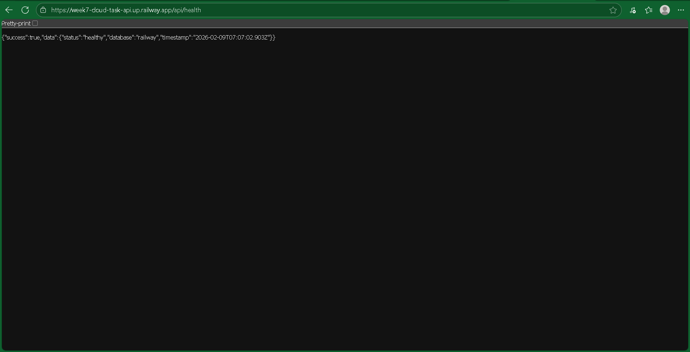
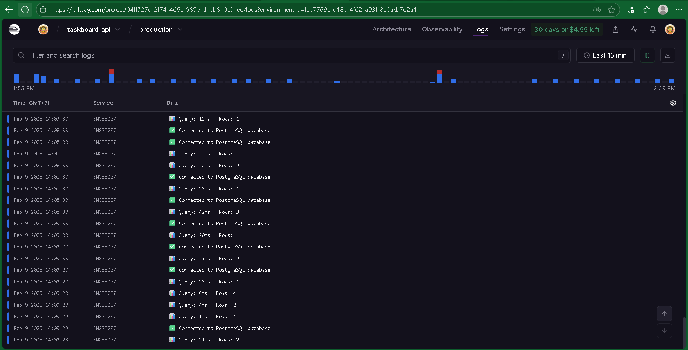
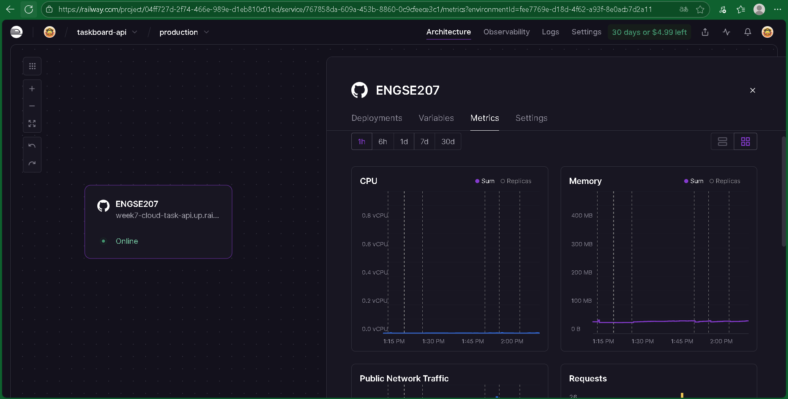

# Cloud Deployment Analysis
## ENGSE207 - Week 7 Lab

**ชื่อ-นามสกุล:** นายศุภโชค แสงจันทร์
**รหัสนักศึกษา:** 67543210066-6

## 1.1 URLs ของระบบที่ Deploy

| Service | URL |
|---------|-----|
| Frontend | https://week7-cloud.up.railway.app/ |
| Backend API | https://week7-cloud-task-api.up.railway.app/ |
| Database | (Internal - ไม่มี public URL) |

## 1.2 Screenshot หลักฐาน (5 รูป)

1. [ ] Railway Dashboard แสดง 3 Services

2. [ ] Frontend ทำงานบน Browser

3. [ ] API Health check response

4. [ ] Logs แสดง requests

5. [ ] Metrics แสดง CPU/Memory

---

## 2.1 ความแตกต่างที่สังเกตเห็น (10 คะแนน)
| ด้าน               | Docker (Week 6)                                          | Railway (Week 7)                                     |
| ------------------ | -------------------------------------------------------- | ---------------------------------------------------- |
| เวลา Deploy        | ใช้เวลานานกว่า ต้อง build image และสั่งรัน container เอง | ใช้เวลาน้อยกว่า สามารถ deploy ได้อัตโนมัติจาก GitHub |
| การตั้งค่า Network | ต้องกำหนด port mapping และ network ด้วยตนเอง             | ระบบจัดการ network และ public URL ให้โดยอัตโนมัติ    |
| การจัดการ ENV      | กำหนดผ่านไฟล์ `.env` และ docker-compose                  | ตั้งค่า ENV ผ่านหน้า Dashboard ของ Railway           |
| การดู Logs         | ดูผ่านคำสั่ง `docker logs` หรือ terminal                 | ดู Logs ได้แบบ real-time ผ่านหน้าเว็บ Railway        |
| การ Scale          | ต้องจัดการเอง เช่น เพิ่ม container หรือปรับ config       | รองรับการ scale อัตโนมัติในระดับ Cloud Platform      |

## 2.2 ข้อดี/ข้อเสีย ของแต่ละแบบ (5 คะแนน)

**Docker Local:**
- ข้อดี: ควบคุมสภาพแวดล้อมการทำงานได้ละเอียด เหมาะสำหรับการพัฒนาและทดสอบระบบในเครื่องตนเอง
- ข้อเสีย: ไม่สะดวกต่อการ deploy จริง และต้องดูแลการตั้งค่า network และ resource เองทั้งหมด

**Railway Cloud:**
- ข้อดี: Deploy ได้รวดเร็ว มีระบบจัดการ infrastructure, logs และ metrics ให้อัตโนมัติ เหมาะสำหรับระบบ Cloud
- ข้อเสีย: มีข้อจำกัดด้านทรัพยากรในแผนฟรี และต้องพึ่งพา platform ภายนอก
---

## 3.1 Railway เป็น Service Modelแบบไหน? ###

[x] PaaS [ ] IaaS [ ] SaaS

เพราะ:
Railway เป็น Platform as a Service (PaaS) เนื่องจากผู้ใช้สามารถนำ source code ขึ้น deploy ได้ทันที โดยไม่ต้องดูแลโครงสร้างพื้นฐาน เช่น server, network, OS หรือการตั้งค่า scaling ระบบจะจัดการให้โดยอัตโนมัติผ่าน platform

## 3.2 ถ้าใช้ IaaS (เช่น AWS EC2) ต้องทำอะไรเพิ่มอีก? (ยกตัวอย่าง 4 ข้อ) ###

1. ต้องติดตั้งและตั้งค่า Operating System บน Virtual Machine ด้วยตนเอง

2. ต้องตั้งค่า Web Server และ Runtime Environment (เช่น Node.js, Docker)

3. ต้องจัดการ Network และ Security เช่น Firewall, Security Group และ Port

4. ต้องดูแลการ scale และ monitoring ระบบเอง เช่น CPU, Memory และ Logs
---

## 4.1 Factors ที่เห็นจาก Lab (10 คะแนน)

จากการทดลอง Deploy ระบบ Task Board บน Railway สามารถสังเกตการทำงานที่สอดคล้องกับหลักการ 12-Factor App ได้ดังนี้

| Factor | เห็นจากไหน? | ทำไมสำคัญ? |
|------|-------------|------------|
| Factor 3: Config | Variables tab ใน Railway | ช่วยแยกค่าการตั้งค่า (เช่น DATABASE_URL, PORT) ออกจาก source code ทำให้ deploy ได้หลาย environment โดยไม่ต้องแก้โค้ด |
| Factor 6: Processes | Railway Service แสดงสถานะ Online/Restart | แอปทำงานแบบ stateless process สามารถ restart หรือ deploy ใหม่ได้โดยไม่กระทบข้อมูล |
| Factor 7: Port Binding | Railway ให้ Public URL และกำหนด PORT ผ่าน ENV | แอปเปิด service ผ่าน port ของตนเอง ทำให้ deploy บน cloud ได้โดยไม่ผูกกับ web server เฉพาะ |
| Factor 10: Dev/Prod Parity | ใช้ Docker และ Node.js เหมือนกันทั้ง Local และ Cloud | ลดปัญหาการทำงานต่างกันระหว่างเครื่องพัฒนาและ production |
| Factor 11: Logs | Logs tab ของ Railway | Logs ถูกแสดงเป็น event stream ทำให้ตรวจสอบการทำงานและ error ได้แบบ real-time |

## 4.2 ถ้าไม่ทำตาม 12-Factor จะมีปัญหาอะไร? (5 คะแนน)

### ปัญหา 1: ถ้าไม่ทำตาม Factor 3 (Config)
- สิ่งที่จะเกิด:  
  ค่าการตั้งค่าถูกเขียน hard-code ไว้ใน source code ทำให้ไม่ปลอดภัย และต้องแก้โค้ดทุกครั้งเมื่อเปลี่ยน environment

### ปัญหา 2: ถ้าไม่ทำตาม Factor 11 (Logs)
- สิ่งที่จะเกิด:  
  ไม่สามารถตรวจสอบ error หรือพฤติกรรมของระบบบน production ได้ ทำให้การแก้ไขปัญหาทำได้ยากและล่าช้า

---

## 5.1 สิ่งที่เรียนรู้จาก Lab นี้

1. ได้เรียนรู้ขั้นตอนการ deploy ระบบแบบ N-tier ทั้งในรูปแบบ Docker (Local) และ Cloud Platform (Railway)  
2. เข้าใจความแตกต่างของการจัดการ infrastructure ระหว่าง Local Environment และ PaaS ซึ่งช่วยลดภาระการดูแลระบบได้อย่างมาก  
3. เรียนรู้การตรวจสอบสถานะระบบผ่าน Logs และ Metrics เพื่อใช้ในการวิเคราะห์และแก้ไขปัญหาในระบบจริง  

## 5.2 ความท้าทาย/ปัญหาที่พบ และวิธีแก้ไข

**ปัญหา:**  
เกิดปัญหา API บาง endpoint ไม่สามารถเรียกใช้งานได้บน Railway ทำให้ frontend แสดง error และไม่สามารถดึงข้อมูลสถิติได้

**วิธีแก้:**  
ตรวจสอบโครงสร้าง route ของ backend ให้ตรงกับ path ที่ frontend เรียกใช้งาน รวมถึงแก้ไขการตั้งค่า server และ deploy ระบบใหม่จนสามารถทำงานได้ถูกต้อง

## 5.3 จะเลือกใช้ Docker หรือ Cloud เมื่อไหร่?

- **ใช้ Docker เมื่อ:**  
  ต้องการพัฒนาและทดสอบระบบในเครื่องตนเอง หรือจำเป็นต้องควบคุมสภาพแวดล้อมการทำงานอย่างละเอียด  

- **ใช้ Cloud (PaaS) เมื่อ:**  
  ต้องการ deploy ระบบให้พร้อมใช้งานจริง ต้องการความสะดวกในการจัดการ server, logs และการ monitor ระบบ โดยไม่ต้องดูแล infrastructure เอง  

---

